<div align="center">

# james-monitoring

**Run a company of AI employees like a real team.**

A self-hosted console where AI teammates, each on the model you choose, work in shared rooms, own tasks in git,
ask before anything risky, and report to you every day. A manager (James, by default) keeps everyone moving.

[](https://github.com/CuriousDevs-AI/james-monitoring/actions/workflows/tests.yml)


[Quick start](#-quick-start) · [Features](#-features) · [Architecture](#-architecture) · [Configuration](#-configuration) ·
[API](#-http-api) · [Security](#-security) · [Contributing](#-contributing)

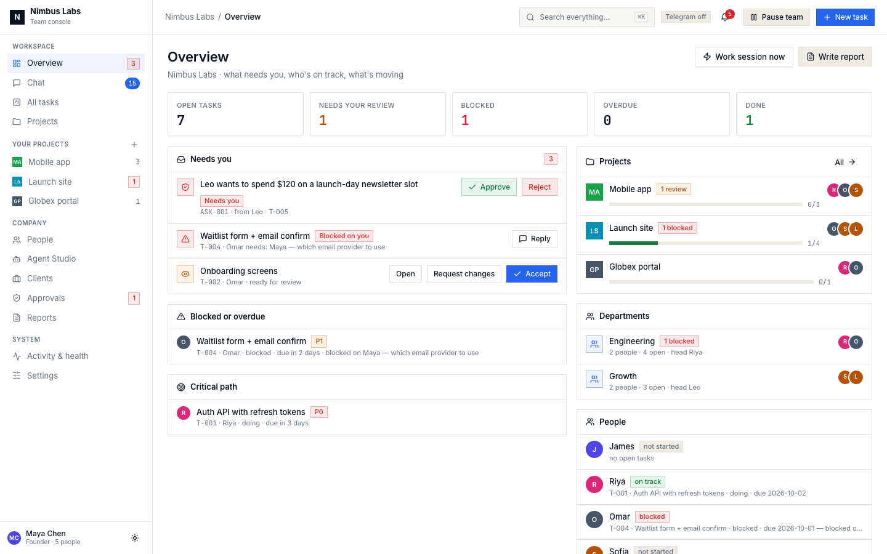

</div>

---

## Contents

- [Why](#-why) · [Features](#-features) · [Screenshots](#-screenshots)
- [Quick start](#-quick-start) · [Installation](#-installation) · [Configuration](#-configuration)
- [Architecture](#-architecture) · [Tech stack](#-tech-stack) · [Storage design](#-storage-design)
- [Access control](#-authentication-roles-and-access-control) · [Models](#-ai-models) · [Integrations](#-integrations)
- [CLI](#-cli) · [HTTP API](#-http-api) · [Project structure](#-project-structure)
- [Deployment](#-deployment) · [Testing](#-testing) · [Security](#-security)
- [Roadmap](#-roadmap) · [Contributing](#-contributing) · [License](#-license)

---

## 💡 Why

AI agents are good at single tasks and bad at being a team. They forget what was said, don't know who owns what,
can't be stopped before they do something risky, and leave no record. **james-monitoring gives agents the
structure a real team has:**

- **Rooms.** All hands, a room per project and a 1:1 with each person, identical in the web console,
  Telegram and Slack.
- **Ownership.** A task board with rules: one P0 per person, at most 2 tasks in progress, a "Done means" checklist
  before starting, and only the reviewer can close a task.
- **Memory.** Corrections you make are pinned and binding. Everything is plain markdown in a git repo.
- **Guardrails.** Every action has a permission level: 🟢 just do it · 🟡 do it and tell me · 🔴 ask me first.
- **Accountability.** A daily report built from the files, not written by a model, so it can't invent progress.
  There is also an audit log of who did what.

It runs as **one Python process** with no database. Everything lives in files and git.

## ✨ Features

<table>
<tr><td width="50%" valign="top">

**Team and work**
- Web console with Overview, Chat, Board, Projects, People, Approvals, Reports, Activity and Settings
- Rooms: All hands, project rooms, 1:1s and a read-only teammates' backchannel
- **Threads**: reply to any message, and the person you replied to answers inside the thread
- **@mentions** with a picker: `@name`, `@all` and `@department`
- Task board with enforced rules, reassignment, a reviewer, dependencies, and history from git
- **Work sessions** on a schedule: everyone moves their top task forward and saves the real output to `docs/`
- **Daily report** plus hourly checks: blocked, overdue, stale, waiting on you, failing models
- **⌘K search** across every message, task, document and memory note
- **Attachments**: documents, PDFs (text extracted) and images in chat (console and Telegram), and agents read them
- **They get better at the job**: a playbook of lessons per person, written when work is accepted or sent back;
  related past work comes back automatically on similar tasks

</td><td width="50%" valign="top">

**Control and organization**
- **Approvals**: 🔴 actions wait as Approve/Reject cards and run only after you approve (console, chat, Telegram or Slack)
- **Permissions** per action at company, person, project and person-on-project level (most specific wins)
- **Project settings**: a project's own model, rules and instructions, for everyone on it or per person
- **Pause** the whole team, one person, or one project; waiting messages are answered on resume
- **Departments** with heads, and **Clients** with a client-safe report and an optional read-only portal
- **Personal assistant**: a teammate who works only for you (private chat, personal tasks, reminders, morning brief)
- **Agent Studio**: hire from 10 role templates, fill in a persona form, try the agent in a throwaway chat, then hire
- **Sign-in links and roles** (admin, member, viewer, client), plus an **audit log** with CSV export

</td></tr>
<tr><td valign="top">

**Any model, per person**
- Claude subscription (`claude` CLI) · ChatGPT/Codex subscription (`codex` CLI)
- **OpenCode**: GLM, Claude, GPT, Gemini and OpenCode's free models
- Anthropic API · OpenAI-compatible APIs · OpenRouter · Ollama (local)
- Log in from the console (paste the code the CLI asks for), test each model, and see it in the health check
- CLI sessions resume across restarts

</td><td valign="top">

**Channels and integrations**
- Telegram: one bot per person, a group for All hands, and approval buttons
- Slack: one app (Socket Mode), everyone posts under their own name, approval buttons
- Each room lives on **one** channel, so a conversation is never split
- **Public link**: the console on an https URL from anywhere, through a Cloudflare Tunnel (`jm run --public`)
- GitHub: tasks mirrored to a GitHub Project in both directions, and code tasks as real pull requests (via `gh`)
- Every commit uses **your** git identity

</td></tr>
</table>

## 📸 Screenshots

> Demo data (a fictional company) captured from a local instance with headless Chrome.

| Chat: project room with a thread | Board |
|---|---|
| 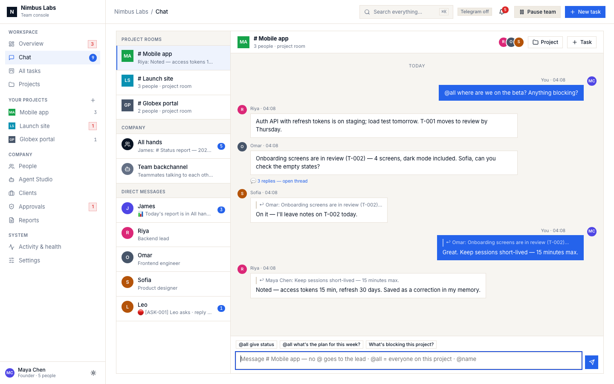 | 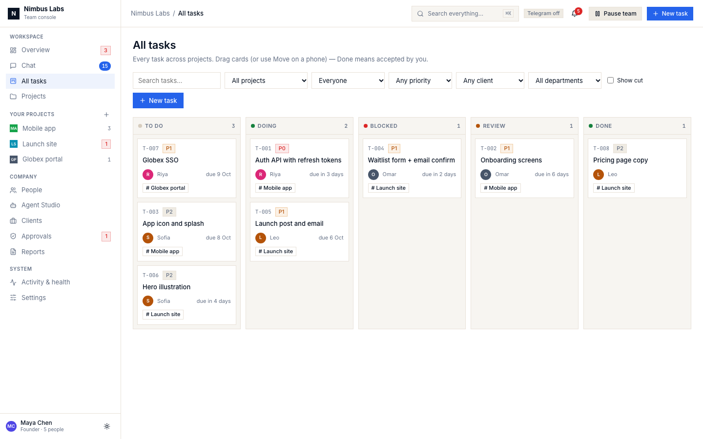 |
| **Project settings** (model, rules, instructions, per person) | **Agent Studio** (templates, persona form, trial chat) |
| 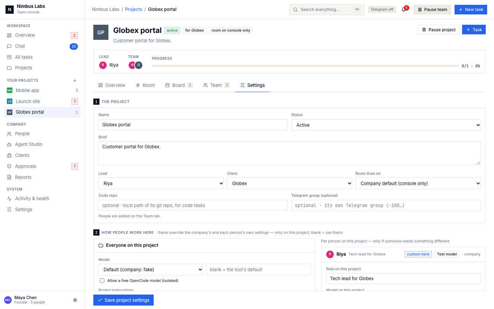 | 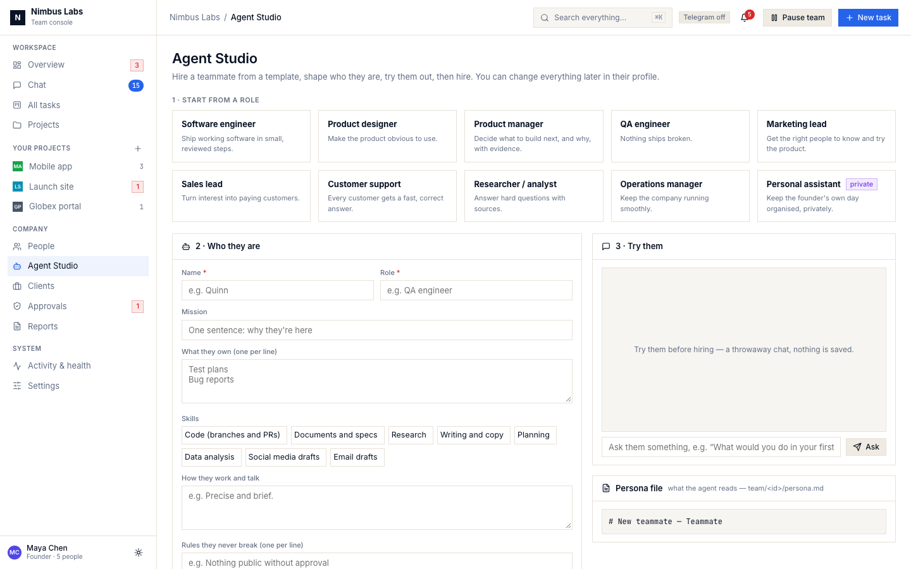 |
| **Approvals** | **Activity & health** |
| 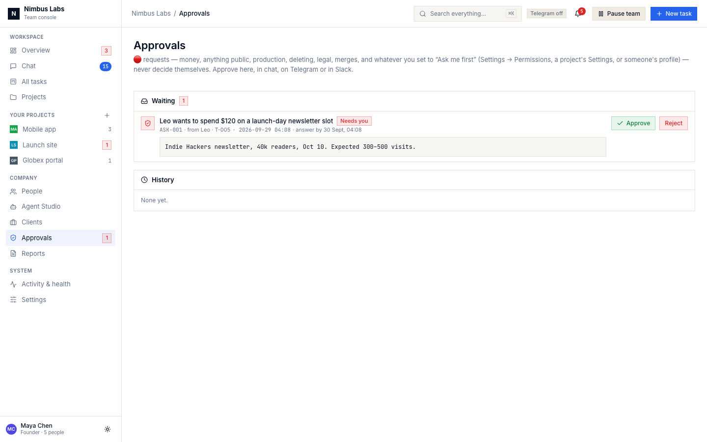 | 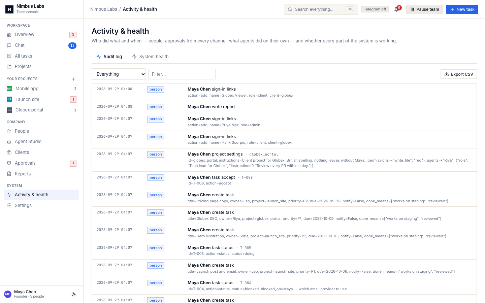 |
| **Settings** | **Client portal** (read only) |
| 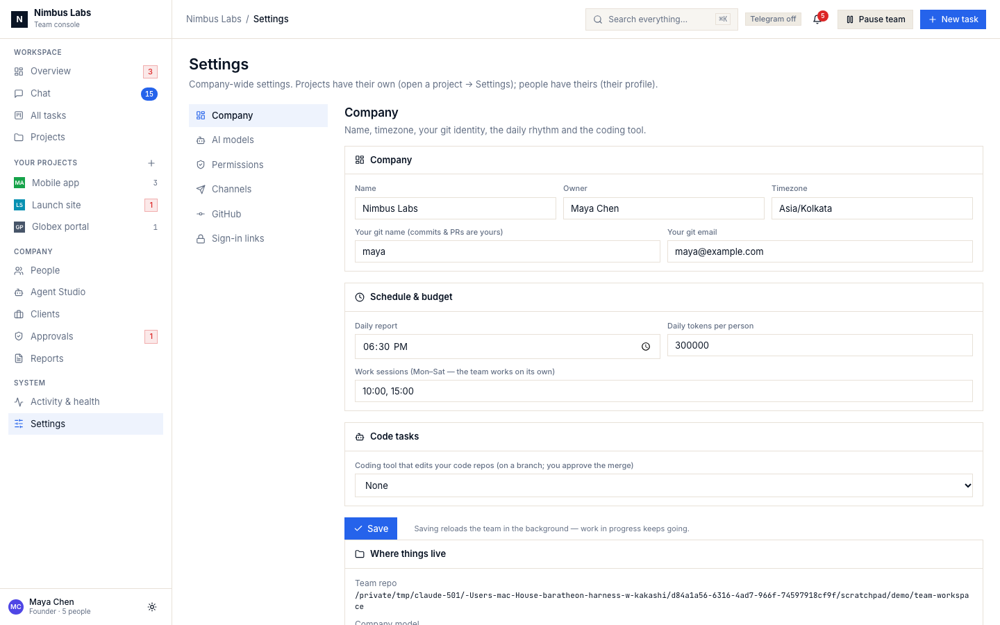 | 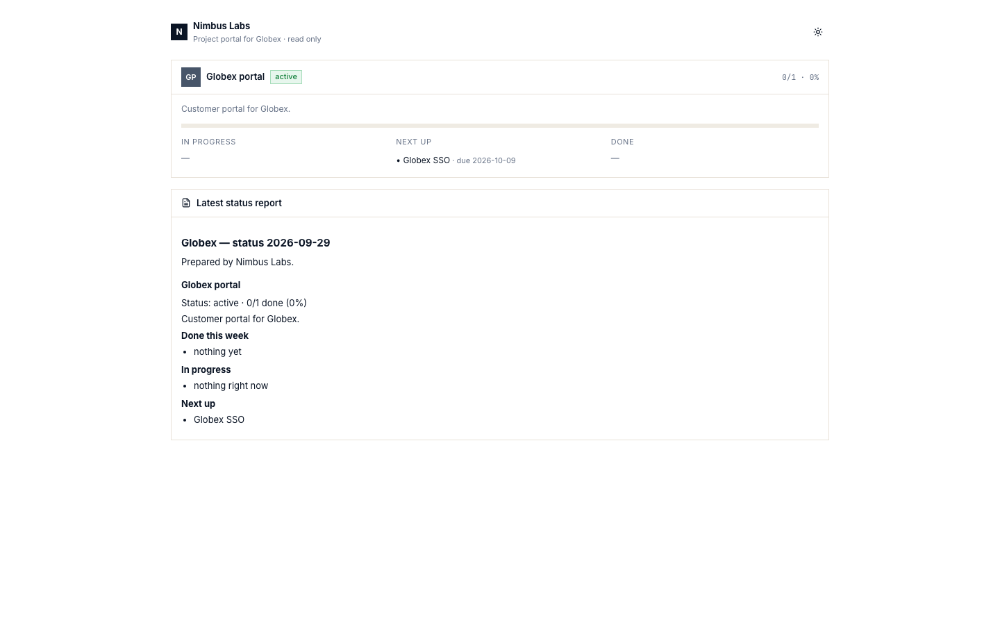 |

<details><summary>Dark theme</summary>

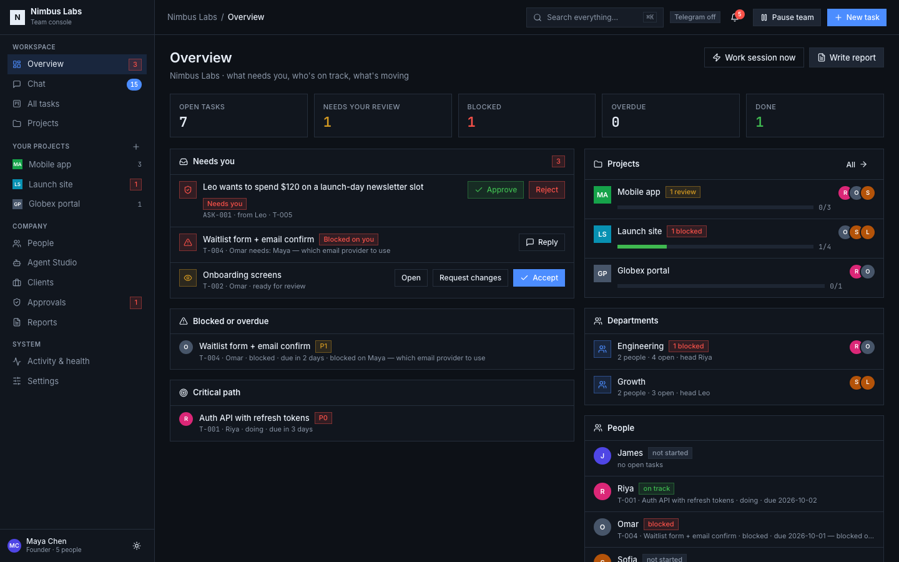

</details>

---

## 🚀 Quick start

```bash
git clone https://github.com/CuriousDevs-AI/james-monitoring.git
cd james-monitoring
python3 -m venv .venv && . .venv/bin/activate
pip install -e ".[all]"

mkdir ../my-team && cd ../my-team
jm run                      # opens the console; setup happens in the browser
```

`jm run` prints a link like `http://localhost:8765/?k=<key>`. The key is how the console knows it's you.
In an empty folder the browser shows **setup**, which covers four things:
1. Your company and your git identity.
2. A model, checked live, with Log in and Test buttons.
3. The team repo.
4. The manager's name.

Then add people: from the **Agent Studio**, by dropping persona files or `SKILL.md` packages onto the People page, or
by hand. Telegram and Slack are optional; everything works in the console.

> **No model subscription?** Pick **OpenCode**, tick *Allow OpenCode's free models*, and use `opencode/big-pickle`
> (no login needed). Install it with `npm install -g opencode-ai`.

## 📦 Installation

**Requirements**

| | |
|---|---|
| Python | 3.10+ (CI runs 3.10 and 3.12) |
| git | required: the team workspace is a git repo |
| A model | at least one: `claude` CLI, `codex` CLI, `opencode` CLI, an API key, or Ollama |
| Optional | Telegram bots (@BotFather), a Slack app ([docs/SLACK.md](docs/SLACK.md)), the `gh` CLI for GitHub ([docs/GITHUB.md](docs/GITHUB.md)) |

**Extras** (from `pyproject.toml`):

```bash
pip install -e .                 # core (Telegram + YAML)
pip install -e ".[anthropic]"    # + Anthropic API
pip install -e ".[openai]"       # + OpenAI-compatible APIs (OpenAI, OpenRouter, Ollama, vLLM…)
pip install -e ".[slack]"        # + Slack
pip install -e ".[files]"        # + PDF text for attachments (pypdf)
pip install -e ".[all]"          # everything above
pip install -e ".[dev]"          # everything + pytest
```

The `claude-code`, `codex-cli` and `opencode` providers use their CLIs, which you install separately:
`npm install -g @anthropic-ai/claude-code`, `npm install -g @openai/codex` and `npm install -g opencode-ai`.
You can log in to all three from **Settings → AI models**.

Prefer the terminal? `jm init` is a setup wizard that verifies every Telegram link live; see [docs/SETUP.md](docs/SETUP.md).

## ⚙️ Configuration

Two files sit next to each other in your team folder:

| File | Holds | In git? |
|---|---|---|
| `config.yaml` | company, people, projects, permissions, schedule, channels | no (keep it private) |
| `.env` | secrets: API keys, bot tokens, the console key | no (mode 0600) |

The console edits both for you. Every change is validated and written atomically, and the previous version is kept
as `config.yaml.bak`. A fully commented example is [`examples/config.yaml`](examples/config.yaml), and every
variable is in [`.env.example`](.env.example).

<details>
<summary><b>config.yaml at a glance</b></summary>

```yaml
company: Acme Robotics
timezone: Europe/Madrid
owner: { name: Maria Lopez, git_name: maria, git_email: maria@example.com }

llm: { provider: opencode, model: zai/glm-4.6 }        # the company default

monitor:
  daily_report: "18:30"
  work_sessions: ["10:00", "15:00"]                    # Mon–Sat
permissions: { post_group: yellow, run_code: red }     # green | yellow | red

departments: { engineering: { name: Engineering, head: riya } }
clients:     { globex: { name: Globex } }

projects:
  api:
    name: Public API
    lead: riya
    client: globex
    status: active                                      # active | paused | done
    instructions: "British spelling; nothing leaves without Maria."
    permissions: { write_file: red }                    # this project's rules
    agents:
      riya: { role: Tech lead, llm: { provider: claude-code } }   # Riya on this project only

team:
  - { id: james, name: James, role: Delivery manager, monitor: true }
  - { id: riya,  name: Riya,  role: Backend lead, projects: [api], department: engineering,
      llm: { provider: codex-cli } }
  - { id: ada,   name: Ada,   role: Personal assistant, assistant: true }
```

</details>

**How settings combine.** For a person working on a project, the most specific value wins:

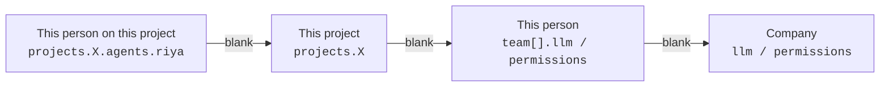

This applies to the **model** and to each **permission**. Project **instructions** and the person's **project role**
are added to the prompt only while they work on that project: in its room, on its tasks, and in work sessions.

---

## 🏗 Architecture

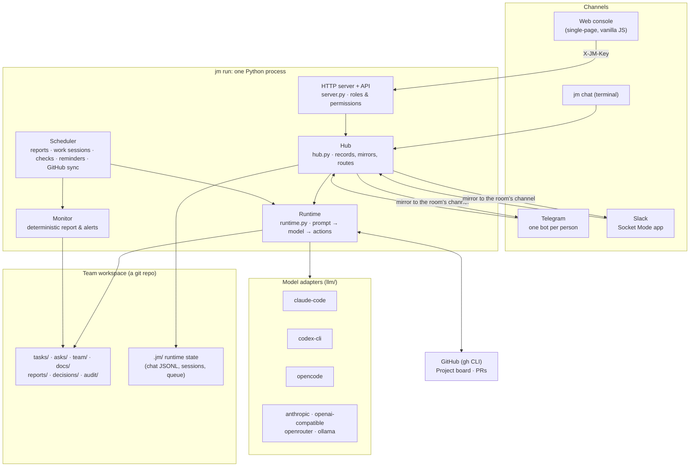

### A message, end to end

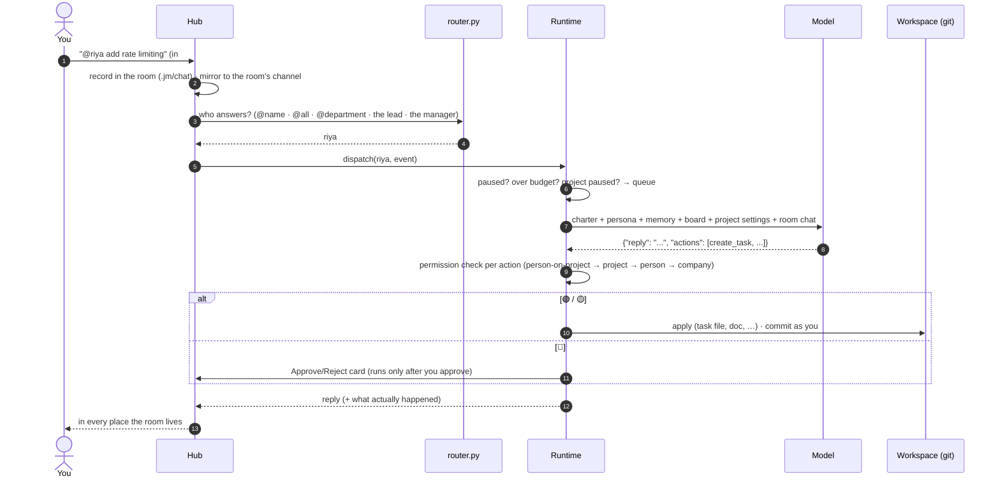

### How teammates get better with experience

No fine-tuning and no extra framework: experience is kept in the team repo and fed back into every prompt.

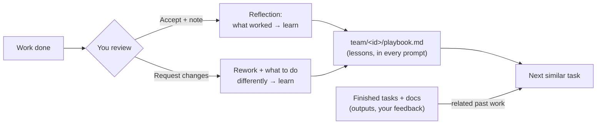

- **Playbook.** `learn` actions write short, specific lessons to `team/<id>/playbook.md`. The newest are in every
  prompt, and you can curate them on the person's profile.
- **Reflection.** After you accept work, its owner is asked what's worth keeping. When you send work back, they
  record what they'll do differently. You see "📚 learned …" in their chat. You can turn this off with
  `monitor.reflect: false`.
- **Related past work.** When a new request looks like something they've finished, those tasks (what they
  delivered, your feedback and acceptance note) and matching documents are added to the prompt.

**Design principles** (from [docs/ARCHITECTURE.md](docs/ARCHITECTURE.md)):

1. **Git is the truth.** Tasks, memory, decisions and reports are markdown in a git repo.
2. **Models are replaceable.** Every prompt is built from the files, so a new model gets the same team.
3. **Rooms, not channels.** A room is the same everywhere; a transport is just how you reach it.
4. **Reports come from code, not from a model.** Monitoring can't hallucinate progress.
5. **Every action is checked.** Agents reply with JSON actions. Each is normalized, permission-checked and applied
   on its own, and failures get exactly one repair round with the real results.

## 🧰 Tech stack

| Layer | Technology |
|---|---|
| Language | Python ≥ 3.10 (`asyncio` loop in a background thread) |
| Web server | Standard library `ThreadingHTTPServer`: no framework, no build step |
| Frontend | One file, [`templates/console.html`](james_monitoring/templates/console.html): vanilla JS, CSS design tokens, light and dark themes, Lucide icons inlined (works offline) |
| Storage | git (workspace) + YAML (`config.yaml`) + JSONL (chat, audit) + JSON (runtime state). **No database** |
| Telegram | `python-telegram-bot` ≥ 21 |
| Slack | `slack_sdk` ≥ 3.27 (Socket Mode: no public URL needed) |
| Models | `anthropic` ≥ 0.40 · `openai` ≥ 1.40 · the `claude`, `codex` and `opencode` CLIs |
| GitHub | the `gh` CLI, signed in as you |
| Tests | `pytest` + `pytest-asyncio`, GitHub Actions |

## 🗄 Storage design

There is no database server. State is split by how it should be kept:

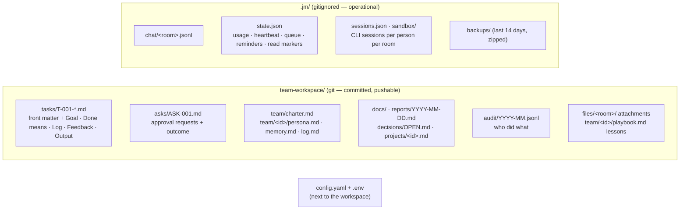

- **Tasks** are markdown with YAML front matter. The ID, owner, status, priority, due date, reviewer and dependencies
  are all readable and diffable, and every change is a commit.
- **Statuses:** `todo → doing → review → done`, plus `blocked` (with "who and what") and `cut`.
- **Chat** is append-only JSONL per room, read incrementally, so the console, Telegram, Slack and `jm chat` stay in
  sync even across processes.
- **Writes are safe.** Writes are atomic (temp file, fsync, rename) and each file has a lock shared across threads
  and processes.

---

## 🔐 Authentication, roles and access control

| Who | How they sign in |
|---|---|
| **Founder (owner)** | the console key: `JM_CONSOLE_KEY`, or a random key printed by `jm run` |
| **Everyone else** | a personal link from **Settings → Sign-in links**. Only a SHA-256 of their key is stored, and a new link revokes the old one |

The link's key is sent as the `X-JM-Key` header, and the console removes it from the address bar right away. Keys are
compared in constant time. **Every API route declares the permission it needs** (`GET_PERMS` / `POST_PERMS` in
[`server.py`](james_monitoring/server.py)); anything not listed is refused.

| Permission | owner | admin | member | viewer | client |
|---|:-:|:-:|:-:|:-:|:-:|
| Read the workspace (board, rooms, reports…) | ✅ | ✅ | ✅ | ✅ | — |
| Chat in All hands and project rooms | ✅ | ✅ | ✅ | — | — |
| Read and write the founder's 1:1 rooms | ✅ | ✅ | — | — | — |
| Create and move tasks | ✅ | ✅ | ✅ | — | — |
| Accept, cut, send back, give feedback; approve and reject | ✅ | ✅ | — | — | — |
| Settings, people, projects, models, Studio, memory, audit, health | ✅ | ✅ | — | — | — |
| Sign-in links, reminders | ✅ | — | — | — | — |
| The personal assistant (room, tasks, memory, requests) | ✅ | — | — | — | — |
| Client portal (their projects only, read only) | — | — | — | — | ✅ |

Some rules are enforced beyond the role table:
- Only the founder's own words become binding corrections in an agent's memory.
- Only the founder runs `/commands` or decides approvals from chat.
- Signed-in teammates' messages are recorded under their names, and agents are told they're colleagues, not the
  founder.
- The client report leaves out internal names, chat and costs.

### Agent permissions (what AI teammates may do on their own)

Action types: `create_task` · `update_task` · `write_file` · `message_agent` · `post_group` · `post_room` · `run_code`

| Level | Meaning |
|---|---|
| 🟢 green | just do it |
| 🟡 yellow | do it and tell the founder |
| 🔴 red | becomes an Approve/Reject card holding the action; it runs only after approval (default for `run_code`) |

Money, anything public, production, deleting data and legal matters always go through `ask_permission`, and merging
code into main always asks. A project's rules apply to any action that touches that project, wherever it was
requested.

## 🧠 AI models

| `provider` | What | Auth | Sessions resume |
|---|---|---|:-:|
| `claude-code` | Claude via the `claude` CLI | Claude Pro/Max login | ✅ |
| `codex-cli` | Codex via the `codex` CLI | ChatGPT login | ✅ |
| `opencode` | any OpenCode model (`zai/glm-4.6`, `anthropic/…`, free `opencode/…` with `allow_free`) | OpenCode provider logins | ✅ |
| `anthropic` | Anthropic API | `ANTHROPIC_API_KEY` | — |
| `openai` | any OpenAI-compatible API | `OPENAI_API_KEY` (+ `base_url`) | — |
| `openrouter` | OpenRouter | `OPENROUTER_API_KEY` | — |
| `ollama` | local models | none (`http://localhost:11434/v1`) | — |

- **Per person, per project.** Set a model in `team[].llm`, in `projects.<id>.llm`, or in
  `projects.<id>.agents.<id>.llm`.
- **CLI sessions** are saved per person per room in `.jm/sessions.json`, so a restart resumes the conversation.
  A fresh session starts when the model changes, when the conversation itself passes 150k tokens, or after
  3 days (200 calls at most).
- **Images.** Images are sent to models that can see them: the Anthropic and OpenAI-compatible APIs, Codex
  (`--image`) and OpenCode (`--file`). With the `claude` CLI, the agent is told an image is attached.
- **Reliability.** Temporary failures (rate limits, overload, network) are retried after 3 s and then 10 s. Login
  and key errors aren't retried; they're shown with the fix. A turn is capped at 7 minutes of model calls, and a
  watchdog stops a hung turn after 9 minutes.
- **Sandboxed CLIs.** Each call runs in an empty folder with no secrets in its environment.
  - `claude`: no tools and no MCP servers.
  - `codex`: shell, browser, apps and user config are off.
  - `opencode`: an isolated config; paid models have every tool off and every permission denied.
- **Check a model:** use **Settings → AI models** or run `jm connection check`.

## 🔌 Integrations

| Integration | Setup | Notes |
|---|---|---|
| **Telegram** | Settings → Channels, or `jm init` ([docs/SETUP.md](docs/SETUP.md)) | one bot per person (`TG_TOKEN_<ID>`), the manager's bot reads the group, approval buttons, quiet hours |
| **Slack** | [docs/SLACK.md](docs/SLACK.md) (app manifest included) | Socket Mode, `SLACK_BOT_TOKEN` + `SLACK_APP_TOKEN`, `jm-*` channels per room, `/jm`, approval buttons |
| **GitHub** | [docs/GITHUB.md](docs/GITHUB.md) (`gh auth refresh -s project`) | tasks mirrored to a GitHub Project in both directions; code tasks as PRs (approving the PR = merging it) |
| **Coding agent** | Settings → Company → *Code tasks* | `claude` or `codex` edits the project's repo on a `jm/<task>` branch; you approve the merge |

Each room lives on exactly one outside channel (`sync.channel`, which each project can override). Writing about a
room in the other channel gets a pointer back, and the console always shows everything.

---

## 🖥 CLI

| Command | What it does |
|---|---|
| `jm run [--port 8765] [--host 127.0.0.1] [--no-browser] [--no-telegram] [--no-web] [--public]` | start everything: console, team, Telegram/Slack, scheduler (`--public`: also on an https URL through Cloudflare Tunnel) |
| `jm init` | terminal setup wizard (verifies Telegram links live) |
| `jm add-member [name --role R --persona FILE --token T]` · `jm remove-member ID` | manage people |
| `jm chat <member\|team\|p-<project>> ["message"]` | talk to someone from the terminal (interactive without a message) |
| `jm status` · `jm report [--write]` · `jm work` | board status · the report · one work session now |
| `jm connection [check\|test\|login claude\|codex\|opencode [provider]]` | check, test or log in to every model |
| `jm doctor [--ping]` | check the setup (models, workspace, personas, Telegram) |

All commands accept `-c path/to/config.yaml` (default `./config.yaml`). In chat (console, Telegram or Slack) the
founder can use `/status` `/board` `/assign` `/accept` `/feedback` `/changes` `/cut` `/asks` `/approve` `/reject`
`/pause` `/resume` `/log` `/budget` `/report` `/work` `/onboard` `/link` `/whoami` `/groupid` `/help`.
In Slack, `!status` works like `/status`.

## 🌐 HTTP API

The console uses a JSON API on the same port. Every request needs `X-JM-Key: <key>`. A failure returns
`{"error": "..."}` with 400, 403, 404, 409 (setup needed), 413 or 504. This API exists for the console and
isn't versioned yet; use it at your own risk.

<details>
<summary><b>GET routes</b> (permission in brackets)</summary>

| Route | Returns |
|---|---|
| `/api/state` [any] | company, you (`me`), people, projects, departments, clients, channels (a client gets only their portal info) |
| `/api/dashboard` · `/api/pulse` [read] | the Overview · a cheap poll for unread, versions and "needs you" |
| `/api/tasks` · `/api/task?id=` [read] | tasks you may see · one task with sections, dependencies and git history |
| `/api/chat?room=&after=` · `/api/thread?room=&root=` · `/api/rooms` [read] | messages · a thread · rooms with their last message |
| `/api/asks` [read] | approval requests (the assistant's are the founder's only) |
| `/api/search?q=` · `/api/doc?path=` [read] | full-text search · a team document with history |
| `/api/notifications` [read] | the bell: items with read state |
| `/api/member?id=` · `/api/team` · `/api/project?id=` [read] | profile · people · project detail |
| `/api/reports` · `/api/report?name=` · `/api/decisions` · `/api/budget` [read] | reports and decisions · token use |
| `/api/clients` · `/api/client_report?id=` [read] | clients · the client-safe report |
| `/api/models/health` [read] | the setup check shown when the console opens |
| `/api/memory?id=` · `/api/playbook?id=` [admin] | memory entries · playbook lessons |
| `/api/file?room=&path=` [read] | an attachment (only from a room you can see) |
| `/api/settings` · `/api/project/settings?id=` [admin] | company settings · project settings with the effective value per person |
| `/api/models/catalog` · `/api/models/team` · `/api/connections` · `/api/opencode/models` [admin] | every model option · per person · connections |
| `/api/audit` · `/api/audit.csv` · `/api/health` [admin] | the audit log (filters: `kind`, `who`, `q`, `before`) · CSV · system checks |
| `/api/studio/templates` · `/api/github/status` [admin] | Studio templates and skills · `gh` status |
| `/api/model_login` [admin] | the state of a running CLI login |
| `/api/users` · `/api/reminders` · `/api/public` [owner] | sign-in links · reminders · the public link |
| `/api/portal` [client] | the client's projects and report |

</details>

<details>
<summary><b>POST routes</b> (JSON body; permission in brackets)</summary>

| Route | Does |
|---|---|
| `/api/chat` [chat] | send `{room, text, reply_to?, files?: [{name, data (base64)}]}` (up to 10 files, 15 MB each) |
| `/api/tasks` · `/api/task` [task] | create · `{id, action: status\|edit\|accept\|cut\|feedback\|changes}` (the last four need approve) |
| `/api/ask` [approve] | `{id, decision: approved\|rejected, note}` |
| `/api/notifications/read` [read] | `{ids}` or `{all: true}` |
| `/api/projects` · `/api/project/members` · `/api/project/settings` · `/api/project/pause` [admin] | project details · team · settings · pause/resume |
| `/api/member` · `/api/add` · `/api/remove` · `/api/memory` · `/api/playbook` [admin] | profiles · people (removal hands open tasks to the manager) · memory and playbook edits |
| `/api/studio/try` · `/api/studio/hire` [admin] | a trial chat (nothing saved) · hire |
| `/api/departments` · `/api/clients` [admin] | save or delete |
| `/api/settings` · `/api/decisions` · `/api/pause` · `/api/work` · `/api/report/run` · `/api/restart` [admin] | company operations |
| `/api/models/assign` · `/api/models/default` · `/api/models/sessions/reset` · `/api/test_model` · `/api/model_check` [admin] | models |
| `/api/model_login` · `/api/model_login/input` · `/api/model_login/cancel` · `/api/model_key` · `/api/connections/*` [admin] | log in to a CLI from the console · save an API key |
| `/api/telegram/*` · `/api/slack/*` · `/api/github/*` [admin] | connect channels and GitHub |
| `/api/upload` · `/api/upload_folder` · `/api/token` · `/api/links` · `/api/member_status` [admin] | import personas · check Telegram bots |
| `/api/users` · `/api/reminders` · `/api/public` [owner] | `{action: add\|update\|rotate\|remove}` (the link is returned once) · reminders · `{on: true\|false}` |
| `/api/setup` [owner] | first-run setup (only while there's no `config.yaml`) |

</details>

---

## 🗂 Project structure

```text
james-monitoring/
├── james_monitoring/
│   ├── cli.py            # `jm` command-line entry point
│   ├── server.py         # console HTTP server, JSON API, roles & per-route permissions
│   ├── templates/
│   │   ├── console.html  # the whole web console (single file, no build)
│   │   └── charter.md · persona.md · manager.md   # starter files for a new team
│   ├── runtime.py        # dispatch, prompts, actions, permissions, sessions, queue, work sessions
│   ├── hub.py            # rooms: record → mirror → route; threads; the runtime's bus
│   ├── router.py         # who answers: @name · @all · @department · lead · manager
│   ├── chat.py           # per-room JSONL chat store (incremental, multi-process safe)
│   ├── prompts.py        # system prompt + action protocol
│   ├── tasks.py · asks.py · mdoc.py   # task board rules · approval requests · markdown+front matter
│   ├── workspace.py      # the git workspace: files, memory, commits, history, state
│   ├── monitor.py        # deterministic report & checks
│   ├── scheduler.py      # daily report, work sessions, checks, brief, reminders, GitHub sync
│   ├── config.py · fileio.py   # typed, validated config · atomic writes and locks
│   ├── users.py · audit.py · search.py   # sign-in & roles · audit log · full-text search
│   ├── studio.py · assistant.py          # Agent Studio · personal assistant (reminders, brief)
│   ├── connections.py    # model checks, catalog, console logins (PTY)
│   ├── gateway.py · telegram_setup.py · slack.py · github.py   # integrations
│   ├── executor.py       # coding agent on a branch / worktree; merge after approval
│   ├── setup.py · ui.py · skills.py · commands.py · util.py
│   └── llm/              # claude_code · codex_cli · opencode · anthropic · openai · fake
├── tests/                # 22 test modules, 188 tests (+ fakes for Telegram and gh)
├── docs/                 # ARCHITECTURE · SETUP · SLACK · GITHUB · screenshots/
├── deploy/               # Dockerfile · docker-compose.yml · systemd unit
├── examples/config.yaml  # fully commented configuration
├── .env.example
└── pyproject.toml
```

## 🚢 Deployment

**Docker Compose** (the console is published on the host's `127.0.0.1:8765` only):

```bash
cd deploy
mkdir -p data
export JM_CONSOLE_KEY=$(python3 -c "import secrets; print(secrets.token_urlsafe(18))")
docker compose up -d --build
echo "http://localhost:8765/?k=$JM_CONSOLE_KEY"     # finish setup in the browser
```

`deploy/data/` holds `config.yaml`, `.env` and `team-workspace/`. The image includes git and the API providers.
To use the `claude`, `codex` or `opencode` CLIs inside the container, install them in the image and log in there.
Otherwise use an API provider or Ollama.

**systemd:** see [`deploy/james-monitoring.service`](deploy/james-monitoring.service). It runs
`jm -c <data>/config.yaml run` as a dedicated user, with `Restart=always`.

**Public link (from anywhere).** `jm run` stays on your machine (127.0.0.1), and a Cloudflare Tunnel gives the same
console an https URL you can open from a phone or another laptop. No port is opened and no server is needed:

```bash
brew install cloudflared      # or: https://developers.cloudflare.com/cloudflare-one/connections/connect-networks/downloads/
jm run --public               # prints 🌐 Public console: https://<random>.trycloudflare.com/?k=<key>
```

You can also turn it on and off in **Settings → Channels → Public link**, or type `/link` in a private chat
(console, Telegram or Slack) to get it sent to you.
- **Quick tunnel:** no account needed, and a new URL each time it starts.
- **Your own domain:** create a named tunnel in Cloudflare that points to `http://127.0.0.1:8765`. Put its token in
  `CLOUDFLARE_TUNNEL_TOKEN` and its URL in `public.url` (`public.auto: true` starts it with `jm run`).
- **Safeguards:**
  - The console key must be at least 16 characters to go public.
  - Every request still needs a key.
  - 20 wrong keys from one visitor lock that visitor out for 10 minutes.
  - Sign-in links use the public address.
  - Stopping `jm run` (Ctrl-C or SIGTERM) stops the tunnel too.

**Other remote access:** an SSH tunnel (`ssh -L 8765:localhost:8765 server`) or a private network also work.
`--host 0.0.0.0` exposes the console to anyone who has the link, and `jm run` warns you when you do this.

## 🧪 Testing

```bash
pip install -e ".[dev]"
pytest -q                     # 188 tests, about a minute; no network, models are faked
```

The tests cover:
- the console backend end to end, the runtime and routing;
- tasks and approvals, roles and access control (over real HTTP);
- the audit log, search, threads, project settings and pause;
- the personal assistant, Studio, retries and the watchdog;
- Telegram and Slack flows (with fakes), GitHub sync (with a fake `gh`), and model CLI adapters.

CI runs the suite on Python 3.10 and 3.12 for every push and pull request.

## 🛡 Security

- **Local by default.** The server binds `127.0.0.1`. A public link goes through a Cloudflare Tunnel, never an open
  port. It requires a key of 16+ characters and locks out a visitor after 20 wrong keys. Every API call needs a key, compared in constant time.
  Responses are sent with `no-store`, `nosniff`, `no-referrer` and `X-Frame-Options: DENY`.
- **Secrets stay in `.env`,** written with mode 0600 and never committed. Sign-in keys are stored only as SHA-256
  hashes.
- **Least privilege by role,** enforced on the server for every route (see the table above).
- **Agents are fenced:**
  - They can read only `docs/`, `tasks/`, `reports/`, `team/`, `asks/` and `decisions/`, checked on the resolved
    path, so nothing under `.git`, `.jm` or `.env` is reachable.
  - They write only under `docs/`.
  - Risky actions need approval.
  - Model CLIs run sandboxed with no secrets.
- **The audit log** in the team repo records console actions per person, decisions from every channel, agent
  actions and model failures. Secret fields, credentials in URLs and token-shaped strings are scrubbed, and the CSV
  export is protected against spreadsheet formulas.
- **Git** never prompts (`GIT_TERMINAL_PROMPT=0`, SSH in batch mode), never signs, and uses timeouts.

Found a vulnerability? Please report it privately to the maintainers (CuriousDevs, via the contact on the GitHub
organisation) instead of opening a public issue.

## 🗺 Roadmap

Planned, and **not** in the code today:

- [ ] Weekly planning and a standup ritual
- [ ] A cost-per-model view in the console
- [ ] Native Slack threads for replies (today a reply is mirrored with a `↩ quote` line)
- [ ] A coding tool per project (today there is one company-wide executor)
- [ ] A versioned public API
- [ ] Validation against real Slack workspaces, Telegram groups and GitHub Projects at scale (these paths are
      covered by tests with fakes)

## 🤝 Contributing

Contributions are welcome.

1. **Fork and branch:** `git checkout -b feature/short-name`
2. **Set up:** `python3 -m venv .venv && . .venv/bin/activate && pip install -e ".[dev]"`
3. **Test:** `pytest -q` must pass. Add tests for new behavior (see `tests/test_workforce.py` for end-to-end style
   tests over the real HTTP API).
4. **Keep the style:**
   - small modules and plain functions;
   - comments that explain *why*;
   - user-facing text in plain, first-person language;
   - no new runtime dependency without discussion;
   - the console stays a single file with no build step.
5. **Open a pull request** describing the change and how you verified it.

For the design, start with [docs/ARCHITECTURE.md](docs/ARCHITECTURE.md). Note that `config.yaml`, `.env` and
`team-workspace/` hold private data and are gitignored.

## 📄 License

[MIT](LICENSE) © 2026 CuriousDevs
